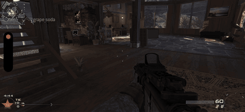

<table align="center">
<tr>
<td align="center" width="50%">

 ▶️ <a href="https://github.com/MarkusSela/IW4-Pocket/blob/main/media/demo.mp4">Ver la demo completa</a> · 18 s, iPhone 13 Pro Max
</td>
<td align="center" width="50%">

 ▶️ <a href="https://github.com/MarkusSela/IW4-Pocket/blob/main/media/treuenten_tes-0.2.1.mov">Ver la demo completa</a> · una partida en iPhone 17 Pro Max, de treuenten
</td>
</tr>
</table>

  

<h1 align="center">IW4 Pocket</h1>

Modern Warfare 2 (2009) en tu iPhone, con el motor de código abierto IW4L. No oficial y experimental.

🌍 <a href="README.md">English</a> · <a href="README.it.md">Italiano</a> · <b>Español</b> · <a href="README.fr.md">Français</a> · <a href="README.de.md">Deutsch</a>

## 🎯 ¿Qué es?

Un port a iOS del motor de código abierto [IW4L](https://github.com/vladtrc/iw4L). **No contiene el juego**: lee los archivos del juego **que ya tienes** en PC. Es un nuevo lector para archivos que ya posees.

## 📊 Cómo va

- ✅ Se ejecuta de forma nativa en iPhone (Rust + Bevy + Metal)
- ✅ Llega al menú principal. El toque funciona como clic y un mando PS4 funciona
- ✅ En un iPhone 17 Pro Max (6 GB concedidos a la app) se juegan partidas completas con bots: [mira el clip](https://jumpshare.com/s/rFCD5I9ZtWvcN3gcBO8e), de [treuenten](https://github.com/treuenten)
- ✅ La app elige sola su configuración de memoria según la memoria que iOS concede al teléfono (baja / media / alta)
- ⚠️ En un iPhone 13 Pro Max (unos 3 GB concedidos), `mp_rust` ahora carga hasta los shaders y luego la app se cierra sola. En investigación

## 🙋 Pruébalo, paso a paso

No hace falta saber programar. Lleva unos 15 minutos más la copia de archivos.

1. **Consigue los archivos del juego.** Necesitas tu propia copia de *Modern Warfare 2 (2009)* para **PC** (versión de Steam). La carpeta debe contener una subcarpeta llamada `zone`. Este proyecto no proporciona ni enlaza archivos del juego
2. **Instala SideStore** en tu iPhone con la [guía oficial](https://sidestore.io). Es la herramienta que instala apps como esta
3. **Descarga la app:** [IW4.Pocket.ipa](https://github.com/MarkusSela/IW4-Pocket/releases/latest/download/IW4.Pocket.ipa) (o abre la [página de la release](https://github.com/MarkusSela/IW4-Pocket/releases/latest))
4. **Instálala con SideStore** (toca **+**, elige el archivo). Si ya tienes una versión anterior, instala **encima**: desinstalar borra tus archivos del juego
5. **Abre la app una vez** y ciérrala. Así crea su carpeta
6. **Copia tu carpeta de MW2** en la app Archivos: *En mi iPhone > IW4 Pocket > Games*. Vale cualquier nombre, si contiene `zone`
7. **Empareja un mando** en los ajustes de Bluetooth (PS4/DualShock 4 verificado) y abre la app. La primera carga es lenta y la pantalla puede quedarse rosa un rato

## 📱 ¿Funcionará en mi dispositivo?

- ✅ **Probado:** iPhone 13 Pro Max (6 GB de RAM, ~3 GB concedidos), iOS 27: los menús funcionan, la carga del mapa llega hasta los shaders. iPhone 17 Pro Max (6 GB concedidos): partidas completas con bots, según treuenten
- ❓ **Todo lo demás no está verificado.** Técnicamente debería funcionar en cualquier iPhone o iPad con Metal; la app declara iOS 15 como mínimo, pero nunca la probé ahí
- 🧠 **La memoria es el límite.** En el teléfono probado iOS permite a la app unos 3 GB. Los dispositivos con menos RAM fallarán antes; los más interesantes para probar son iPhone de 8 GB+ y iPad con chip M
- 🎮 **Se necesita un mando para jugar.** El toque solo funciona en los menús

## 🐞 Ayúdame a probar

¿Lo probaste? [Abre un issue](https://github.com/MarkusSela/IW4-Pocket/issues/new) con:

- tu dispositivo y versión de iOS
- qué pasó (¿menú? ¿mapa cargado? ¿app cerrada?)
- el archivo `iw4l-boot.log` en *En mi iPhone > IW4 Pocket*. Registra el inicio, la memoria y los fallos

## 🔧 ¿Algo falla?

- **"MW2 Multiplayer was not found"**: la carpeta debe estar dentro de `Games` y contener `zone`
- **Pantalla rosa mucho rato**: espera, la primera carga es lenta
- **Mando no detectado**: empárejalo primero en Bluetooth y reabre la app
- **La app se cierra en un mapa**: es el problema de memoria conocido. Envía el registro
- **Para limitar texturas**: añade un archivo de texto `iw4l-texture-cap.txt` con solo un número, por ejemplo `256`, y reinicia la app por completo
- **Avanzado:** un archivo de texto `iw4l-env.txt` con líneas `IW4L_NOMBRE=valor` ajusta los interruptores del motor sin recompilar. Los nombres deben empezar por `IW4L_`

## 🛠️ Compilarlo tú mismo

Ejecuta el workflow **ios-release** desde la pestaña Actions (runner macOS) e indica una etiqueta.

## ⚖️ Créditos y aviso legal

Port de [IW4L](https://github.com/vladtrc/iw4L) de vladtrc y colaboradores (Apache-2.0, ver `LICENSE`, `NOTICE`; README original en `README.upstream.md`). Correcciones de memoria, texturas BC, gestión de fotogramas y correcciones del motor: [treuenten](https://github.com/treuenten) ([issue #1](https://github.com/MarkusSela/IW4-Pocket/issues/1)).

> Proyecto no oficial, sin afiliación con Activision, Infinity Ward, Apple ni los autores de IW4L. Call of Duty y Modern Warfare son marcas de sus propietarios. Necesitas una copia legítima del juego.

---

☕ ¿Te gusta? Apoya el proyecto en <a href="https://ko-fi.com/marukoshi">Ko-fi</a>

